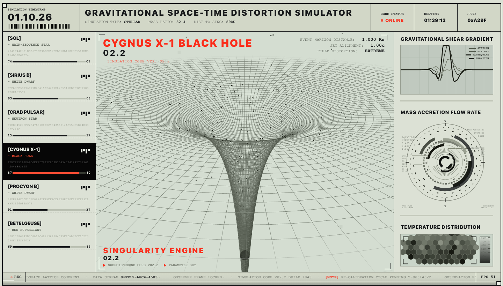

# Spacetime Gravity-Well Console

Interactive visualization of how compact objects warp a spacetime sheet — a wireframe
mesh whose well shape, depth and spin are **derived from each body's real mass and
radius**, not hand-tuned per object.



*Cygnus X-1 (stellar-mass black hole). The HUD's `EVENT HORIZON DISTANCE 1.000 Rs` /
`JET ALIGNMENT 1.00c` / `FIELD DISTORTION EXTREME` are computed from mass and radius, and
the funnel runs off the bottom of the frame because `2Ψ → 1` makes the depth diverge.*

## Origin

This is a reproduction of the app concept shown in
[@DilumSanjaya's X video](https://x.com/DilumSanjaya/status/2052063467407057112)
("Fun interactive science app ideas | Part 2 — Made an app to visualize how massive
objects like black holes warp spacetime"; design by Nano Banana 2, code by Gemini 3.1 Pro).

The original was published as a video only, so the UI here was reconstructed from
reference frames — layout, typography and HUD copy measured against the reference image
rather than copied from source. The physics model, the mesh/spin derivation and the
instrument code are implemented in this repo.

## The bodies

| Body | Type | Mass (M☉) | Radius (km) |
| --- | --- | --- | --- |
| Sol | main-sequence star | 1.0 | 695,700 |
| Sirius B | white dwarf | 1.02 | 5,850 |
| Crab Pulsar | neutron star | 1.4 | 12 |
| Cygnus X-1 | black hole (Rs taken as surface) | 14.8 | 43.7 |
| Procyon B | white dwarf | 0.6 | 1,450 |
| Betelgeuse | red supergiant | 16.5 | 883,000,000 |

A red supergiant and a stellar-mass black hole differ by ~7 orders of magnitude in
compactness, so a linear mapping would show only one of them. Everything below is
scaled through a compression that stays strictly order-preserving.

## Physics model

Membrane height is the **regularized (softened) Newtonian potential**:

```
z(r) = -μ / √(r² + a²)
```

- `a` — core radius (softening length) = the displayed wireframe sphere radius
- `μ = depth · a` — displayed gravity parameter

For `r ≫ a` this returns to `-μ/r` (correct 1/r long tail, far field flattens naturally);
at `r = 0` it is finite (`z = -depth`), which removes the divergence of a true 1/r well.
This form is the exact regularization of a uniform spherical shell, so "denser ⇒ deeper
and narrower well" emerges on its own.

Compactness `Ψ = GM/(Rc²)` is compressed by power law:

```
depth ∝ Ψ^0.18        # denser → deeper well
a     ∝ R^(1/9)        # larger → wider well
```

plus a **horizon hang factor** `(1 − 2Ψ)^−0.18` on the depth. As `2Ψ → 1` the surface is
at its own event horizon and the well has no bottom to sit on, so depth should diverge:
a neutron star (`2Ψ ≈ 0.34`) is barely affected and shows a visible pointed bottom, while
a black hole is clipped at a renderable finite value and runs off the bottom of the frame.
That contrast comes out of the formula, not from per-body tuning.

Spin is the Keplerian angular velocity of the sheet, evaluated at the body's surface:

```
ω(r) = √( μ / (r² + a²)^1.5 ),  spin = ω(a) × 0.4
```

so smaller bodies spin faster — angular momentum conservation showing up directly.

The three top-right HUD readouts are pure SI derivations with **no display compression**,
so they are monotonic in compactness across all six bodies:

| Readout | Quantity | Meaning |
| --- | --- | --- |
| EVENT HORIZON DISTANCE | `R / Rs` | how many Schwarzschild radii outside its own horizon the surface sits (exactly 1.00 for a black hole) |
| JET ALIGNMENT | `v_esc / c = √(2Ψ)` | the criterion for whether relativistic jets can be collimated |
| FIELD DISTORTION | `Ψ` bucket | LOW / MEDIUM / HIGH / EXTREME by compactness magnitude |

## What's on screen

- **Center viewport** — wireframe spacetime mesh, dense wireframe sphere, dust particles
  and in-plane spirals, ambient travelling waves, and a switching shockfront: changing
  bodies launches a Gaussian ring at the well bottom that propagates outward at finite
  speed with cylindrical `1/√r` spreading decay, so a switch reads as a disturbance
  crossing the sheet instead of an instant reshape.
- **Left rail** — body cards with hex digests and progress bars.
- **Right rail** — instruments: accretion dial, shear waveform scope, hex heatmap.
- **Top / bottom bars** — mass ratio, distance to singularity, status line.

Rendering detail: the height field is evaluated as *ring × spoke* rather than per-vertex.
Potential and radial waves depend only on `r`, and the azimuthal modes are separable, so a
~12k-vertex mesh costs 92 ring evaluations + 128 spoke evaluations + one multiply-add per
frame instead of 12k trig calls. Particles and mesh share `sheetHeight()`, so they stay
exactly in phase.

## Stack

React 19 · TypeScript · Vite 7 · three.js 0.180. CSS Grid layout, design tokens in
`src/styles/tokens.css`, no state-management library.

## Getting started

```bash
npm install
npm run dev             # vite dev server
npm run build           # tsc --noEmit && vite build → dist/
npm run build:desktop   # single-file desktop/web/index.html (see below)
npm run preview         # serve the production build
```

## As a desktop wallpaper

`desktop/` turns the console into a live desktop background.

**macOS: download `GravityWellDesktop-*-macOS.zip` from
[Releases](https://github.com/Zhenghong-Liu/spacetime-gravity-well/releases), unzip,
double-click.** The app carries the site inside it, moves itself to `~/Applications` and
registers its own login item on first launch — one click, no Terminal, no network, no
Node or Xcode required. `卸载.command` in the same zip undoes all of it.

Building from source instead:

```bash
bash desktop/install-macos.sh       # build → .app in ~/Applications → launch
bash desktop/uninstall-macos.sh     # undo everything
bash desktop/macos/make-release.sh  # produce the release assets
```

macOS ships a ~300-line native shell (`desktop/macos/`) that pins a `WKWebView` to the
desktop window layer, so the console sits under the Dock and above the desktop icons —
you can drag to orbit the well straight from the desktop, and a menu-bar item switches
back to a click-through ambient layer.

Windows and Ubuntu reuse the same single-file build instead of custom code: Lively
Wallpaper loads `desktop/web/index.html` directly, and `desktop/linux/desktop-x11.sh`
lowers a kiosk browser to the desktop layer with `wmctrl`. Wayland has no API for that —
see [desktop/README.md](desktop/README.md) for the details and caveats.

The build is inlined into **one HTML file with zero external requests** on purpose:
WebKit and Chromium both refuse to load ES modules cross-origin from `file://`, so a
multi-file build silently renders the shell and never starts React. No local HTTP server
is involved anywhere.

## Repository layout

```
src/
  App.tsx                 layout skeleton + body selection
  data/bodies.ts          per-body copy and HUD values (text contract)
  scene/
    physics.ts            real mass/radius → well depth, core radius, spin, HUD readouts
    sheet.ts              membrane height field: potential + travelling waves + shockfront
    SpaceScene.ts         three.js engine: mesh, wireframe sphere, camera, fog, decor, frame loop
    bodyVisuals.ts        wireframe sphere / body rendering
    hudReadouts.ts        real quantities → the three viewport readouts
    util.ts               math helpers (smoothstep etc.)
  components/             TopBar / LeftRail / CenterStage / RightRail / BottomBar
  instruments/            AccretionDial / ShearScope / HexHeatmap
  styles/                 global.css, tokens.css
desktop/                  wallpaper packaging (see desktop/README.md)
  macos/                  native desktop-layer shell + build/install scripts
  linux/                  X11 kiosk-to-desktop-layer script
  web/                    build:desktop output (gitignored)
docs/                     design notes (see caveat below)
scripts/                  dev-only capture & comparison helpers (Node .mjs)
```

## Notes & caveats

- `docs/*.md` describe an earlier architecture in which each body owned a
  `src/scene/profiles/<id>.ts` file. That directory no longer exists — shape is now
  derived entirely from `src/scene/physics.ts`. The docs are kept as design history.
- Screenshot output (`shots/`) and the reference frames (`reference_images/`) are
  gitignored; `docs/screenshots/` is a manual copy kept only for this README.
  `scripts/refcmp.mjs` and the `scripts/shot*.mjs` helpers expect `reference_images/`
  to exist locally, so they won't run on a fresh clone.
- Not a scientific instrument: display values are compressed for readability, and
  Schwarzschild radii / compactness are the honest parts.

## License

MIT — see [LICENSE](LICENSE).

This is a reproduction of a UI concept shown in a third-party video (see
[Origin](#origin)). The license covers the code in this repository; it does not grant any
rights over the original author's design, video, or name.
